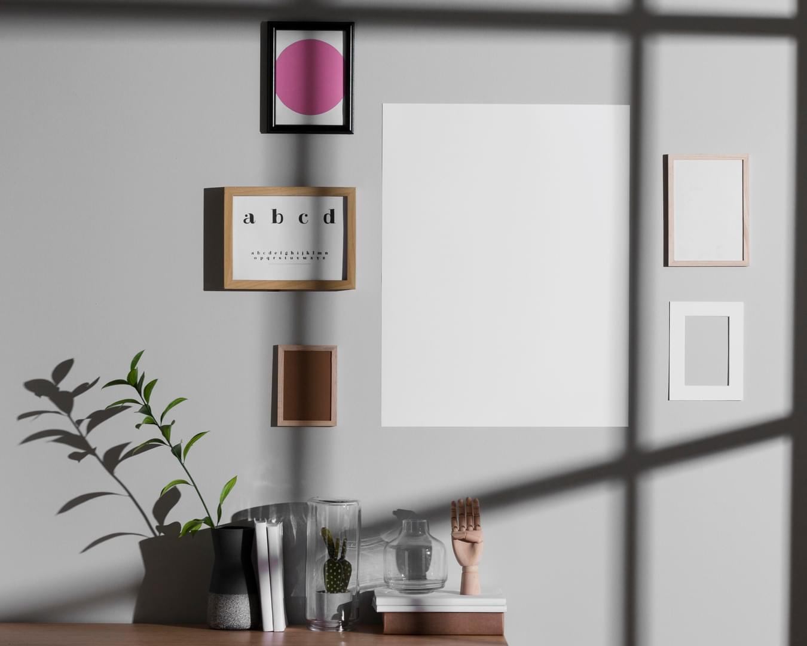

<!DOCTYPE html>
<html style="font-size: 16px;" lang="es">
    <head>
        <meta name="viewport" content="width=device-width, initial-scale=1.0">
        <meta charset="utf-8">
        <meta name="keywords" content="Welcome!, We Create, We work with user research, UX design, UI and engineering, ​Corporate Identity, Brand Identity Design Agency, ​Information partners">
        <meta name="description" content="">
        <title>Home 1</title>
        <link rel="stylesheet" href="nicepage.css" media="screen">
        <link rel="stylesheet" href="index.css" media="screen">
        
        
        <meta name="generator" content="Nicepage 7.13.9, nicepage.com">
        <link id="u-page-google-font" rel="stylesheet" href="https://fonts.googleapis.com/css2?display=swap&amp;family=Roboto:ital,wght@0,100;0,200;0,300;0,400;0,500;0,600;0,700;0,800;0,900;1,100;1,200;1,300;1,400;1,500;1,600;1,700;1,800;1,900&amp;family=Open+Sans:ital,wght@0,300;0,400;0,500;0,600;0,700;0,800;1,300;1,400;1,500;1,600;1,700;1,800&amp;family=PT+Sans:ital,wght@0,400;0,700;1,400;1,700">
        
        <meta name="theme-color" content="#478ac9">
        <meta property="og:title" content="Home 1">
        <meta property="og:type" content="website">
        <meta data-intl-tel-input-cdn-path="intlTelInput/">
    </head>
    <body data-home-page="https://website6573148.nicepage.io/Home-1.html?version=c0a68f9f-c59c-d5cf-fd5d-d1dd8f256845" data-home-page-title="Home 1" data-path-to-root="./" data-include-products="false" class="u-body u-clearfix u-xl-mode" data-lang="es">
        <header class="u-align-center-xs u-border-1 u-border-grey-25 u-clearfix u-header u-header" id="sec-19e8">
            

                
                <nav class="u-align-left u-menu u-menu-hamburger u-nav-spacing-25 u-offcanvas u-menu-1" data-responsive-from="XL" role="navigation">
                    

                        <a class="u-button-style u-custom-active-color u-custom-border u-custom-border-color u-custom-hover-color u-custom-left-right-menu-spacing u-custom-padding-bottom u-custom-text-active-color u-custom-text-color u-custom-text-hover-color u-custom-top-bottom-menu-spacing u-hamburger-link u-nav-link u-hamburger-link-1" href="#" tabindex="-1" aria-label="Open menu" aria-controls="9f3e">
                            <svg class="u-svg-link" preserveAspectRatio="xMidYMin slice" viewBox="0 0 302 302" style="">
                                <use xmlns:xlink="http://www.w3.org/1999/xlink" xlink:href="#svg-7b92"></use>
                            </svg>
                            <svg xmlns="http://www.w3.org/2000/svg" xmlns:xlink="http://www.w3.org/1999/xlink" version="1.1" id="svg-7b92" x="0px" y="0px" viewBox="0 0 302 302" style="enable-background:new 0 0 302 302;" xml:space="preserve" class="u-svg-content">
                                <g>
                                    <rect y="36" width="302" height="30"></rect>
                                    <rect y="236" width="302" height="30"></rect>
                                    <rect y="136" width="302" height="30"></rect>
                                </g>
                                <g></g>
                                <g></g>
                                <g></g>
                                <g></g>
                                <g></g>
                                <g></g>
                                <g></g>
                                <g></g>
                                <g></g>
                                <g></g>
                                <g></g>
                                <g></g>
                                <g></g>
                                <g></g>
                                <g></g>
                            </svg>
                        </a>
                    

                    

                        <ul class="u-nav u-spacing-2 u-unstyled u-nav-1" role="menubar">
                            <li class="u-nav-item" role="none">
                                <a class="u-active-grey-5 u-border-active-palette-1-base u-border-hover-palette-1-base u-button-style u-hover-grey-10 u-nav-link u-text-active-grey-90 u-text-grey-90 u-text-hover-grey-90" href="#" style="padding: 10px 20px;" tabindex="-1" role="menuitem">Home</a>
                            </li>
                        </ul>
                    

                    

                        

                            

                                

                                <ul class="u-align-center u-nav u-popupmenu-items u-unstyled u-nav-2">
                                    <li class="u-nav-item">
                                        <a class="u-button-style u-nav-link" href="#" style="padding: 10px;">Home</a>
                                    </li>
                                </ul>
                            

                        

                        

                    

                </nav>
            

        </header>
        <section class="u-clearfix u-image u-section-1" id="sec-5968">
            

                

                    

                        

                            

                                

                                    
Mi nombre es Francisca Moncada, soy ingeniera en informática &nbsp;con conocimientos en ciencia de datos, conocimientos en AWS.

                                    
                                

                            

                            

                                

                                    

                                        

                                            <h2 class="u-text u-text-2">Welcome!</h2>
                                            
                                        

                                    

                                

                            

                        

                    

                

                
            

        </section>
        <section class="u-clearfix u-section-2" id="block-2">
            

                

                    

                        

                            

                                

                            

                            

                                

                                    <h2 class="u-align-center u-text u-text-default u-text-1">Titular de muestra</h2>
                                    
Texto de muestra. Haz click para seleccionar el elemento de Texto.

                                

                            

                        

                    

                

            

        </section>
        <section class="u-clearfix u-image u-section-3" id="carousel_479d" data-image-width="1980" data-image-height="1200">
            

                

                    <svg class="u-svg-link" preserveAspectRatio="none" viewBox="0 0 160 150" style="">
                        <use xlink:href="#svg-58d1"></use>
                    </svg>
                    <svg class="u-svg-content" viewBox="0 0 160 150" x="0px" y="0px" id="svg-58d1">
                        <path d="M43.2,126.9c14.2,1.3,27.6,7,39.1,15.6c8.3,6.1,19.4,10.3,32.7,5.3c11.7-4.4,18.6-17.4,21-30.2c2.6-13.3,8.1-25.9,15.7-37.1
	c8.3-12.1,10.8-27.9,5.3-42.7C150.5,20.3,134.6,9,117,7.6C107.9,6.9,98.8,5,90.1,1.9C83-0.6,75-0.7,67.4,2.1
	c-9.9,3.7-17,11.6-20.1,21c-3.3,10.1-10.9,18-20.6,22.2c-0.1,0-0.1,0.1-0.2,0.1c-20.3,8.9-31,32-24.6,53.2
	C6.9,115.6,25.2,125.2,43.2,126.9z"></path>
                    </svg>
                

                
                

                    

                        <h2 class="u-text u-text-default u-text-1">We Create</h2>
                        <h3 class="u-text u-text-default u-text-2">Amazing Websites</h3>
                        
Duis aute irure dolor in reprehenderit in voluptate velit esse cillum dolore eu fugiat nulla pariatur. Excepteur sint occaecat cupidatat non proident, sunt in culpa qui officia deserunt mollit anim id est laborum.

                        

                            Image from <a href="https://www.freepik.com/psd/mockup" class="u-active-none u-border-1 u-border-active-grey-50 u-border-black u-border-hover-grey-50 u-border-no-left u-border-no-right u-border-no-top u-btn u-button-link u-button-style u-hover-none u-none u-text-body-color u-btn-1" target="_blank">Freepik</a>
                        

                        <a href="#" class="u-active-palette-2-base u-black u-btn u-btn-round u-button-style u-hover-palette-2-base u-radius-2 u-text-active-white u-text-hover-white u-btn-2">Learn more</a>
                    

                

            

        </section>
        <section class="u-align-center u-clearfix u-container-align-center u-grey-10 u-section-4" id="carousel_0a37">
            

                <h2 class="u-text u-text-1">We work with user research, UX design, UI and engineering</h2>
                

                    

                        

                            

                                

                            

                            

                                

                                    

                                        

                                            

                                                

                                                    
                                                        <svg class="u-svg-link" preserveAspectRatio="xMidYMin slice" viewBox="0 0 512 512" style="">
                                                            <use xlink:href="#svg-0865"></use>
                                                        </svg>
                                                        <svg class="u-svg-content" viewBox="0 0 512 512" id="svg-0865">
                                                            <path d="m459.539062 52.460938c-33.832031-33.828126-78.8125-52.460938-126.65625-52.460938s-92.820312 18.632812-126.652343 52.460938c-33.832031 33.832031-52.460938 78.8125-52.460938 126.65625 0 42.808593 14.917969 83.324218 42.289063 115.609374l-36.214844 36.214844c-18.566406-9.570312-41.984375-6.585937-57.527344 8.957032l-87.863281 87.867187c-9.320313 9.320313-14.453125 21.710937-14.453125 34.890625s5.132812 25.570312 14.453125 34.890625c9.621094 9.617187 22.253906 14.429687 34.890625 14.429687s25.269531-4.8125 34.890625-14.429687l87.867187-87.867187c9.320313-9.316407 14.453126-21.707032 14.453126-34.890626 0-8.011718-1.898438-15.734374-5.480469-22.648437l36.199219-36.203125c32.289062 27.375 72.804687 42.292969 115.613281 42.292969 47.84375 0 92.824219-18.632813 126.652343-52.460938 33.828126-33.832031 52.460938-78.808593 52.460938-126.65625 0-47.839843-18.632812-92.820312-52.460938-126.652343zm-308.652343 336.007812-87.867188 87.867188c-7.539062 7.539062-19.8125 7.539062-27.355469 0-3.652343-3.65625-5.664062-8.511719-5.664062-13.679688s2.011719-10.023438 5.664062-13.679688l87.867188-87.863281c7.539062-7.542969 19.8125-7.542969 27.355469 0s7.542969 19.8125 0 27.355469zm287.4375-103.914062c-28.164063 28.164062-65.609375 43.675781-105.441407 43.675781-39.828124 0-77.273437-15.511719-105.4375-43.675781-28.164062-28.164063-43.675781-65.609376-43.675781-105.4375 0-39.832032 15.511719-77.277344 43.675781-105.441407 28.164063-28.164062 65.609376-43.675781 105.4375-43.675781 39.832032 0 77.277344 15.511719 105.441407 43.675781 28.164062 28.164063 43.675781 65.609375 43.675781 105.4375 0 39.832031-15.511719 77.277344-43.675781 105.441407zm0 0"></path>
                                                            <path d="m256.882812 180.113281c-8.28125 0-15 6.714844-15 15v48.003907c0 8.285156 6.71875 15 15 15 8.285157 0 15-6.714844 15-15v-48.003907c0-8.285156-6.714843-15-15-15zm0 0"></path>
                                                            <path d="m306.882812 130.113281c-8.28125 0-15 6.714844-15 15v98.003907c0 8.285156 6.71875 15 15 15 8.285157 0 15-6.714844 15-15v-98.003907c0-8.285156-6.714843-15-15-15zm0 0"></path>
                                                            <path d="m356.882812 150.113281c-8.28125 0-15 6.714844-15 15v78.003907c0 8.285156 6.71875 15 15 15 8.285157 0 15-6.714844 15-15v-78.003907c0-8.285156-6.714843-15-15-15zm0 0"></path>
                                                            <path d="m406.882812 100.113281c-8.28125 0-15 6.714844-15 15v128.003907c0 8.285156 6.71875 15 15 15 8.285157 0 15-6.714844 15-15v-128.003907c0-8.285156-6.714843-15-15-15zm0 0"></path>
                                                        </svg>
                                                    
                                                    <h5 class="u-text u-text-default u-text-2">Research user needs</h5>
                                                    
Discover pain points and understand user behaviour

                                                

                                            

                                            

                                                

                                                    
                                                        <svg class="u-svg-link" preserveAspectRatio="xMidYMin slice" viewBox="0 0 512 512" style="">
                                                            <use xlink:href="#svg-61e8"></use>
                                                        </svg>
                                                        <svg class="u-svg-content" viewBox="0 0 512 512" x="0px" y="0px" id="svg-61e8" style="enable-background:new 0 0 512 512;">
                                                            <g>
                                                                <g>
                                                                    <path d="M467,61h-30c-8.284,0-15,6.716-15,15v45H301V45c0-24.813-20.187-45-45-45s-45,20.187-45,45v76H90V76    c0-8.284-6.716-15-15-15H45C20.187,61,0,81.187,0,106v361c0,24.813,20.187,45,45,45h422c24.813,0,45-20.187,45-45V106    C512,81.187,491.813,61,467,61z M452,91h15c8.271,0,15,6.729,15,15v318.57c-4.693-1.664-9.743-2.57-15-2.57h-15V91z M241,45    c0-8.271,6.729-15,15-15s15,6.729,15,15v15h-30V45z M256,328.972L193.042,287L256,245.028L318.958,287L256,328.972z M331,315.028    v53.944l-60,40v-53.944L331,315.028z M241,355.028v53.944l-60-40v-53.944L241,355.028z M241,90h30v74.877l-15,29.25l-15-29.25V90z     M30,106c0-8.271,6.729-15,15-15h15v331H45c-5.257,0-10.307,0.906-15,2.57V106z M467,482H45c-8.271,0-15-6.729-15-15    s6.729-15,15-15h30c8.284,0,15-6.716,15-15V151h121v17.5c0,2.38,0.566,4.727,1.653,6.845l23.895,46.596L157.68,274.52    c-0.092,0.061-0.178,0.128-0.269,0.191c-4.09,2.867-6.411,7.513-6.411,12.29v90c0,5.015,2.506,9.699,6.68,12.481l90,60    c0.053,0.035,0.108,0.065,0.162,0.099c4.921,3.197,11.309,3.242,16.318,0c0.053-0.035,0.108-0.064,0.161-0.099l90-60    c4.173-2.782,6.68-7.466,6.68-12.481v-90c0-5.147-2.676-9.819-6.68-12.481l-78.868-52.579l23.895-46.596    c1.086-2.118,1.653-4.464,1.653-6.845V151h121v286c0,8.284,6.716,15,15,15h30c8.271,0,15,6.729,15,15S475.271,482,467,482z"></path>
                                                                </g>
                                                            </g>
                                                        </svg>
                                                    
                                                    <h5 class="u-text u-text-default u-text-4">Prototype an idea</h5>
                                                    
Validate ideas with an interactive prototype of your vision

                                                

                                            

                                            

                                                

                                                    
                                                        <svg class="u-svg-link" preserveAspectRatio="xMidYMin slice" viewBox="0 0 512 512" style="">
                                                            <use xlink:href="#svg-a216"></use>
                                                        </svg>
                                                        <svg class="u-svg-content" viewBox="0 0 512 512" id="svg-a216">
                                                            <path d="m497 90c8.284 0 15-6.716 15-15v-60c0-8.284-6.716-15-15-15h-60c-8.284 0-15 6.716-15 15v15h-332v-15c0-8.284-6.716-15-15-15h-60c-8.284 0-15 6.716-15 15v60c0 8.284 6.716 15 15 15h15v332h-15c-8.284 0-15 6.716-15 15v60c0 8.284 6.716 15 15 15h60c8.284 0 15-6.716 15-15v-15h332v15c0 8.284 6.716 15 15 15h60c8.284 0 15-6.716 15-15v-60c0-8.284-6.716-15-15-15h-15v-332zm-45-60h30v30h-30zm-422 0h30v30h-30zm30 452h-30v-30h30zm422 0h-30v-30h30zm-30-60h-15c-8.284 0-15 6.716-15 15v15h-332v-15c0-8.284-6.716-15-15-15h-15v-332h15c8.284 0 15-6.716 15-15v-15h332v15c0 8.284 6.716 15 15 15h15z"></path>
                                                            <path d="m386.936 346.137-117.573-230.597c-2.562-5.024-7.724-8.187-13.363-8.187s-10.802 3.163-13.363 8.187l-117.573 230.597c-.019.038-.033.077-.051.115-2.655 5.043-4.013 10.337-4.013 15.748 0 46.729 87.455 60 135 60 47.625 0 135-13.297 135-60 0-5.411-1.358-10.705-4.012-15.748-.019-.038-.033-.077-.052-.115zm-130.936-190.761 80.317 157.527c-24.213-7.405-53.276-10.903-80.317-10.903s-56.104 3.498-80.317 10.904zm0 236.624c-52.218 0-105-16.226-105-30 0-.513.203-1.144.602-1.877 6.174-11.342 43.624-28.123 104.398-28.123s98.224 16.781 104.398 28.123c.399.733.602 1.365.602 1.877 0 13.784-52.678 30-105 30z"></path>
                                                        </svg>
                                                    
                                                    <h5 class="u-text u-text-default u-text-6">Design a new product</h5>
                                                    
Launch an MVP with a best in class user experience

                                                

                                            

                                            

                                                

                                                    
                                                        <svg class="u-svg-link" preserveAspectRatio="xMidYMin slice" viewBox="0 0 512 512" style="">
                                                            <use xlink:href="#svg-0fd4"></use>
                                                        </svg>
                                                        <svg class="u-svg-content" viewBox="0 0 512 512" id="svg-0fd4">
                                                            <g>
                                                                <path d="m497 61h-452c-8.284 0-15 6.716-15 15v45h-15c-8.284 0-15 6.716-15 15s6.716 15 15 15h15v30h-15c-8.284 0-15 6.716-15 15s6.716 15 15 15h15v30h-15c-8.284 0-15 6.716-15 15s6.716 15 15 15h15v30h-15c-8.284 0-15 6.716-15 15s6.716 15 15 15h15v30h-15c-8.284 0-15 6.716-15 15s6.716 15 15 15h15v45c0 8.284 6.716 15 15 15h452c8.284 0 15-6.716 15-15v-360c0-8.284-6.716-15-15-15zm-15 360h-422v-30h15c8.284 0 15-6.716 15-15s-6.716-15-15-15h-15v-30h15c8.284 0 15-6.716 15-15s-6.716-15-15-15h-15v-30h15c8.284 0 15-6.716 15-15s-6.716-15-15-15h-15v-30h15c8.284 0 15-6.716 15-15s-6.716-15-15-15h-15v-30h15c8.284 0 15-6.716 15-15s-6.716-15-15-15h-15v-30h422z"></path>
                                                                <path d="m159.32 358.481 36.68-24.453 81.592 54.395c5.187 3.509 11.843 3.364 16.815 0l81.593-54.395 36.68 24.453c6.881 4.587 16.198 2.745 20.801-4.16 4.596-6.893 2.733-16.206-4.16-20.801l-38.321-25.548v-81.972c0-8.455-6.591-12.381-6.68-12.481l-83.32-55.547v-21.972c0-8.284-6.716-15-15-15s-15 6.716-15 15v21.972l-83.32 55.547c-.007.005-.014.01-.021.015-4.14 2.772-6.659 7.475-6.659 12.466v81.972l-38.32 25.547c-6.894 4.595-8.756 13.908-4.16 20.801 4.609 6.915 13.928 8.743 20.8 4.161zm201.68-50.509-60 40v-53.945l60-40zm-90 40-60-40v-53.945l60 40zm15-163.944 62.958 41.972-62.958 41.972-62.958-41.972z"></path>
                                                            </g>
                                                        </svg>
                                                    
                                                    <h5 class="u-text u-text-default u-text-8">Improve a product</h5>
                                                    
Become a category leader using designops and UX/UI design

                                                

                                            

                                        

                                    

                                

                            

                        

                    

                

                

                    Image from <a href="https://www.freepik.com/vectors/man" class="u-active-none u-border-1 u-border-active-palette-4-base u-border-black u-border-hover-palette-4-base u-border-no-left u-border-no-right u-border-no-top u-btn u-button-link u-button-style u-hover-none u-none u-text-active-black u-text-body-color u-text-hover-black u-btn-1" target="_blank">Freepik</a>
                

            

        </section>
        <section class="u-align-center-lg u-align-center-md u-align-center-sm u-align-center-xl u-align-left-xs u-clearfix u-grey-10 u-section-5" id="carousel_b0ad">
            

                <h2 class="u-text u-text-default u-text-1">Corporate Identity</h2>
                
Congue eu consequat ac felis donec et odio. Sed libero enim sed faucibus turpis in. Amet mattis vulputate enim nulla aliquet porttitor. Urna duis convallis convallis tellus id interdum velit. 

                

                    Images from 
                    <b>
                        <a href="https://www.freepik.com/photos/business" class="u-border-1 u-border-black u-border-no-left u-border-no-right u-border-no-top u-btn u-btn-rectangle u-button-link u-button-style u-none u-btn-1" target="_blank">Freepik</a>
                    </b>
                

                

                    

                        

                            

                                

                                

                                    

                                        <h5 class="u-text u-text-4">Brand Strategy</h5>
                                        

                                        
Duis aute irure dolor in reprehenderit in voluptate velit esse cillum dolore eu fugiat nulla pariatur. Excepteur sint occaecat cupidatat non proident, sunt in culpa qui officia deserunt mollit anim id est laborum.

                                        <a href="#" class="u-border-2 u-border-active-palette-2-light-3 u-border-hover-palette-2-light-3 u-border-no-left u-border-no-right u-border-no-top u-border-palette-4-base u-btn u-button-style u-none u-text-active-black u-text-body-color u-text-hover-black u-btn-2">learn more</a>
                                    

                                

                            

                        

                        

                            

                                

                                

                                    

                                        <h5 class="u-text u-text-default u-text-6">Campaign Creative</h5>
                                        

                                        
Duis aute irure dolor in reprehenderit in voluptate velit esse cillum dolore eu fugiat nulla pariatur. Excepteur sint occaecat cupidatat non proident, sunt in culpa qui officia deserunt mollit anim id est laborum.

                                        <a href="#" class="u-border-2 u-border-active-palette-2-light-3 u-border-hover-palette-2-light-3 u-border-no-left u-border-no-right u-border-no-top u-border-palette-4-base u-btn u-button-style u-none u-text-active-black u-text-body-color u-text-hover-black u-btn-3">learn more</a>
                                    

                                

                            

                        

                        

                            

                                

                                

                                    

                                        <h5 class="u-text u-text-default u-text-8">Marketing Campaigns</h5>
                                        

                                        
Duis aute irure dolor in reprehenderit in voluptate velit esse cillum dolore eu fugiat nulla pariatur. Excepteur sint occaecat cupidatat non proident, sunt in culpa qui officia deserunt mollit anim id est laborum.

                                        <a href="#" class="u-border-2 u-border-active-palette-2-light-3 u-border-hover-palette-2-light-3 u-border-no-left u-border-no-right u-border-no-top u-border-palette-4-base u-btn u-button-style u-none u-text-active-black u-text-body-color u-text-hover-black u-btn-4">learn more</a>
                                    

                                

                            

                        

                    

                

            

        </section>
        <section class="u-align-center u-clearfix u-container-align-center u-image u-section-6" id="carousel_da77" data-image-width="1980" data-image-height="1321">
            

        </section>
        <section class="u-clearfix u-grey-10 u-section-7" id="carousel_33d9">
            

                

                
                
                

                    

                        <h2 class="u-text u-text-1">
                            Brand Identity Design Agency 
                        </h2>
                        <ul class="u-custom-list u-spacing-13 u-text u-text-2">
                            <li>
                                

                                    <svg class="u-svg-content" viewBox="0 0 512 512" id="svg-227a" style="font-size: 1em; margin: -1em;">
                                        <path d="m433.1 67.1-231.8 231.9c-6.2 6.2-16.4 6.2-22.6 0l-99.8-99.8-78.9 78.8 150.5 150.5c10.5 10.5 24.6 16.3 39.4 16.3 14.8 0 29-5.9 39.4-16.3l282.7-282.5z" fill="currentColor"></path>
                                    </svg>
                                

                                Lectus urna duis convallis.&nbsp;
                            </li>
                            <li>
                                

                                    <svg class="u-svg-content" viewBox="0 0 512 512" id="svg-227a" style="font-size: 1em; margin: -1em;">
                                        <path d="m433.1 67.1-231.8 231.9c-6.2 6.2-16.4 6.2-22.6 0l-99.8-99.8-78.9 78.8 150.5 150.5c10.5 10.5 24.6 16.3 39.4 16.3 14.8 0 29-5.9 39.4-16.3l282.7-282.5z" fill="currentColor"></path>
                                    </svg>
                                

                                Tortor at auctor urna nunc id.
              
                            </li>
                            <li>
                                

                                    <svg class="u-svg-content" viewBox="0 0 512 512" id="svg-227a" style="font-size: 1em; margin: -1em;">
                                        <path d="m433.1 67.1-231.8 231.9c-6.2 6.2-16.4 6.2-22.6 0l-99.8-99.8-78.9 78.8 150.5 150.5c10.5 10.5 24.6 16.3 39.4 16.3 14.8 0 29-5.9 39.4-16.3l282.7-282.5z" fill="currentColor"></path>
                                    </svg>
                                

                                Odio ut enim blandit volutpat.
              
                            </li>
                        </ul>
                        

                            Images​ from <a href="https://www.freepik.com/photos/business" class="u-border-2 u-border-black u-border-no-left u-border-no-right u-border-no-top u-btn u-button-link u-button-style u-none u-text-body-color u-btn-1">Freepik</a>
                        

                        <a href="#" class="u-active-palette-2-base u-black u-border-none u-btn u-btn-round u-button-style u-hover-palette-2-base u-radius-2 u-text-active-white u-text-hover-white u-btn-2">contact us</a>
                    

                

            

        </section>
        <section class="u-align-center u-clearfix u-container-align-center u-image u-section-8" id="carousel_524f" data-image-width="1890" data-image-height="1354">
            

                <h2 class="u-text u-text-default u-text-1">Information partners </h2>
                

                    Paragraph. Lorem ipsum dolor sit amet, consectetur adipiscing elit. Curabitur id suscipit ex. Suspendisse rhoncus laoreet purus <a href="#" class="u-border-1 u-border-active-palette-4-base u-border-black u-border-hover-palette-4-base u-border-no-left u-border-no-right u-border-no-top u-btn u-button-link u-button-style u-none u-text-active-black u-text-body-color u-text-hover-black u-btn-1">quis elementum</a>
                    . Phasellus sed efficitur dolor, et ultricies sapien. Quisque fringilla sit amet dolor commodo efficitur.
        
                

                

                    

                        

                            

                                
                            

                        

                        

                            

                                
                            

                        

                        

                            

                                
                            

                        

                        

                            

                                
                            

                        

                        

                            

                                
                            

                        

                    

                

                

                    Images from <a href="https://www.freepik.com/vectors/background" class="u-active-none u-border-1 u-border-active-palette-4-base u-border-black u-border-hover-palette-4-base u-border-no-left u-border-no-right u-border-no-top u-btn u-button-link u-button-style u-hover-none u-none u-text-active-black u-text-body-color u-text-hover-black u-btn-2">Freepik</a>
                

            

        </section>
        <section class="u-align-center u-clearfix u-container-align-center u-image u-shading u-section-9" id="block-1">
            

                <h1 class="u-align-center u-text u-text-default u-title u-text-1">INTUITIVO</h1>
                
Sample text. Lorem ipsum dolor sit amet, consectetur adipiscing elit nullam nunc justo sagittis suscipit ultrices.

                <a href="#" class="u-align-center u-btn u-button-style u-palette-2-base u-btn-1">Leer más</a>
            

        </section>
        <footer class="u-align-center u-clearfix u-container-align-center u-footer u-grey-80 u-footer" id="sec-c62f">
            

                
Sample text. Click to select the text box. Click again or double click to start editing the text.

            

        </footer>
        <section class="u-backlink u-clearfix u-grey-80">
            This <a href="https://nicepage.com/html5-template">HTML5 Template</a>
            was created with Nicepage 
    
        </section>
    </body>
</html>

